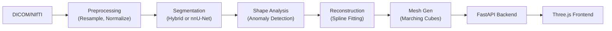

# 🫁 TracheaAI

**AI-Powered Trachea Segmentation, Reconstruction, & Interactive 3D Web Viewer**

TracheaAI is an advanced medical imaging pipeline designed to process DICOM/NIfTI CT scans, intelligently segment the trachea, predict its healthy anatomical state, detect structural anomalies (like stenosis or dilation), and present everything in a premium, browser-based 3D interactive viewer.

---

## 🌟 Key Features

1. **AI Segmentation Engine**: Hybrid rule-based & region-growing segmentor with controlled leakage prevention. (Ready for nnU-Net deep learning integration).
2. **Healthy State Reconstruction**: Uses anatomical shape priors and spline-based interpolation to predict what a diseased/stenotic trachea would look like in a healthy state.
3. **Automated Anomaly Detection**: Automatically flags narrowing (stenosis) and widening (dilation) along the centerline, computing percentage deviations.
4. **Premium 3D Web Viewer**:
   - Built with **Three.js** and **FastAPI**.
   - Real-time morphing animations (Diseased ↔ Healthy).
   - Side-by-side 3D rendering.
   - Interactive 2D CT slice viewer with synchronized cross-section diameter profiles.
5. **High-Performance Pipeline**: Written in Python, utilizing PyTorch with Apple Silicon (MPS) and CUDA support for rapid local or server-based processing.

---

## 🛠️ Architecture Overview



---

## 💻 Installation

### Prerequisites
- Python 3.10+
- Git

### Setup
1. Clone the repository:
   ```bash
   git clone https://github.com/PratikSinha123/trachea.ai.git
   cd trachea.ai
   ```

2. Install dependencies:
   ```bash
   pip install -r requirements.txt
   ```

---

## 🚀 Usage

### 1. Process a New Scan
You can process a raw DICOM folder or an already-converted NIfTI file.

**From DICOM:**
```bash
python3 auto_pipeline.py /path/to/dicom_folder --ai --scan-id patient_001
```

**From NIfTI:**
```bash
python3 auto_pipeline.py --ai --process-nifti /path/to/ct_scan.nii.gz --scan-id patient_001
```

### 2. Launch the 3D Viewer
To start the FastAPI web server and explore the results:
```bash
# Start server only
python3 auto_pipeline.py --server-only --port 8000

# Or process and serve in one command:
python3 auto_pipeline.py /path/to/dicom_folder --ai --serve
```
Open **`http://localhost:8000`** in your browser.

---

## 🧠 Training the Deep Learning Model (nnU-Net)

TracheaAI is set up to transition from its hybrid segmentor to a state-of-the-art **nnU-Net** deep learning model.

1. **Prepare the Dataset**: Convert your processed data into nnU-Net format.
   ```bash
   python3 data_preparation/nnunet_dataset.py
   ```
2. **Train the Model** (Requires GPU or Apple MPS):
   ```bash
   python3 training/run_nnunet_training.py --fold 0 --epochs 500
   ```

---

## 📂 Repository Structure

- `auto_pipeline.py`: The main CLI entry point.
- `segmentation/`: Preprocessing, hybrid segmentor, and 3D U-Net structures.
- `reconstruction/`: Shape models, anomaly detection, and healthy volume generation.
- `visualization/`: Marching cubes mesh generation and GLB exporting.
- `server/`: FastAPI application and pipeline orchestrator.
- `frontend/`: HTML, CSS, and Three.js JavaScript for the 3D viewer.
- `data_preparation/`: Scripts for converting data to nnU-Net training format.
- `training/`: Wrapper scripts for training AI models.

---

## 📝 License

This project is intended for research and educational purposes. Ensure you have the appropriate permissions and anonymization procedures in place when working with real patient DICOM data.
